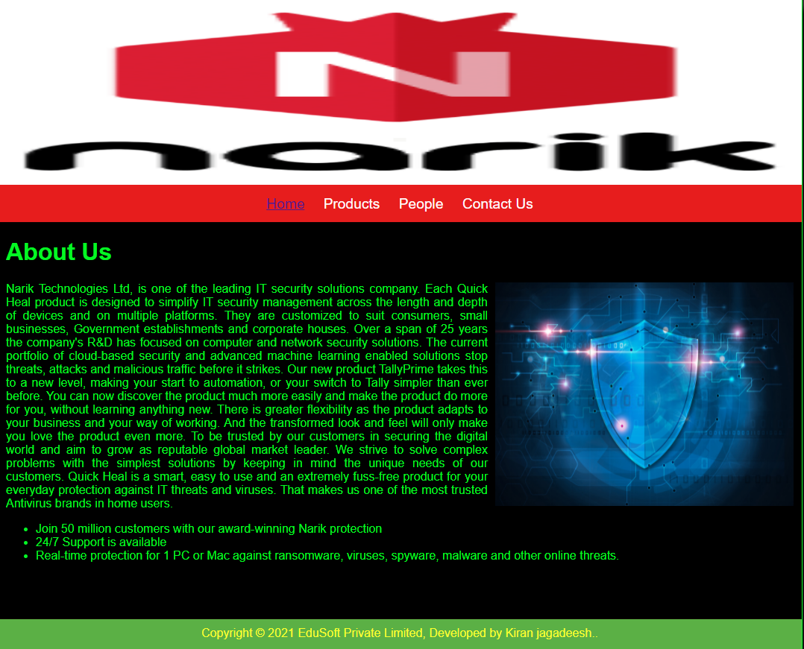
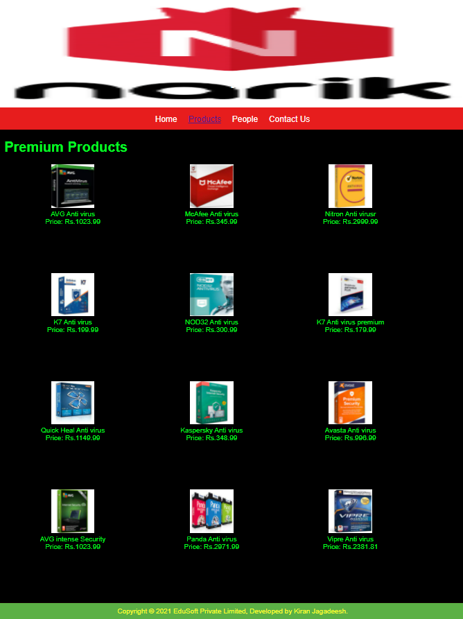
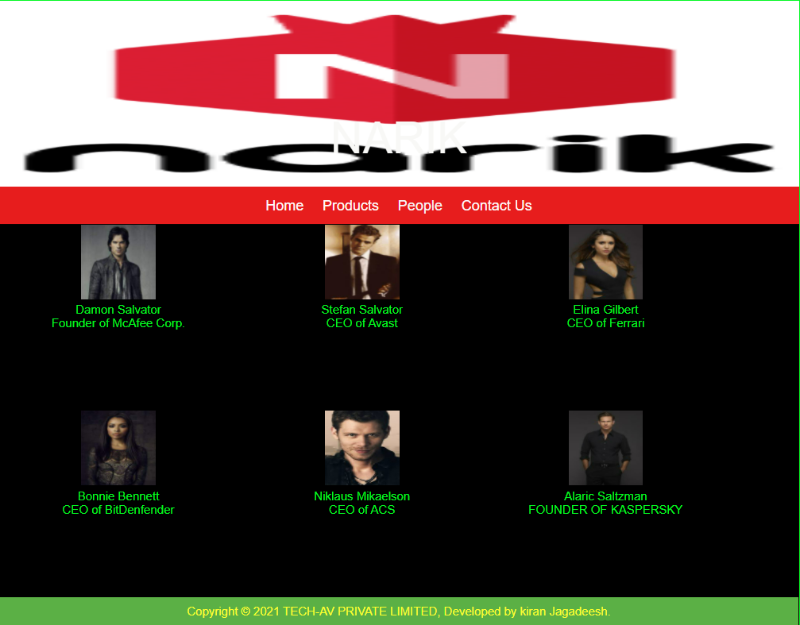
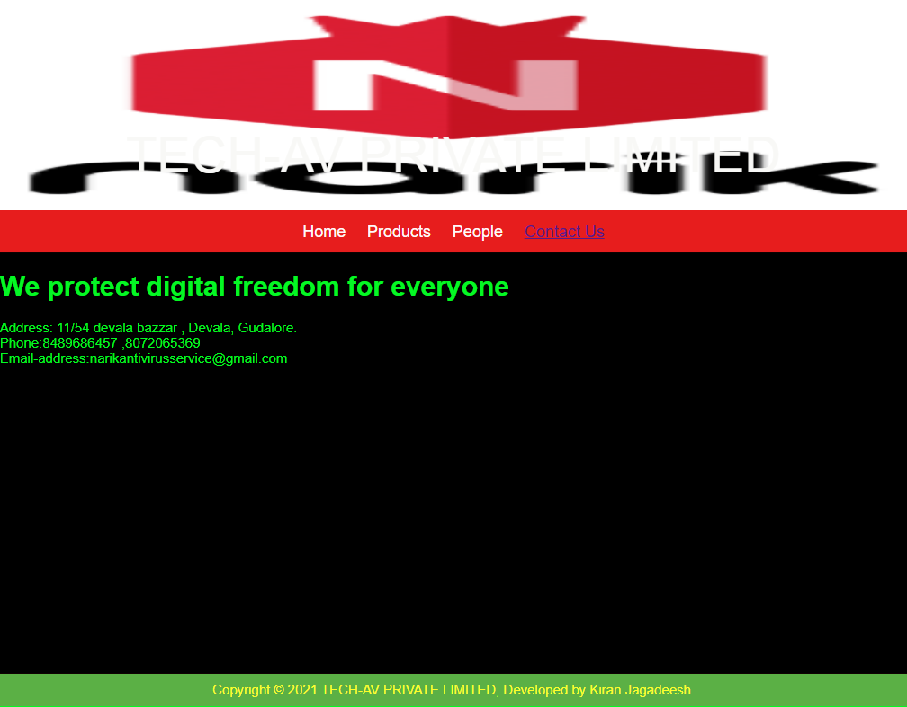

# Web Design for a Software Product Company

## AIM:

To design a static website for a software product company company.

## DESIGN STEPS:

### Step 1:

Requirement collection.

### Step 2:

Creating the layout using HTML and CSS.

### Step 3:

Updating the sample content.

### Step 4:

Choose the appropriate style and color scheme.

### Step 5:

Validate the layout in various browsers.

### Step 6:

Validate the HTML code.

### Step 6:

Publish the website in the given URL.

## PROGRAM :

## HOME:
~~~
<!DOCTYPE html>
<html lang="en">
  <head>
    <title>EduSoft Private Limited</title>
    <link rel="stylesheet" href="./css/layout.css" />
    <link rel="icon" href="./img/icon.png" type="image/x-icon" />
  </head>

  <body>
    

      
-

      

        
<a href="/static/home.html">Home</a>

        
<a href="/static/products.html">Products</a>

        
<a href ="/static/people.html">People</a>

        
<a href ="/static/contact.html">Contact Us</a>

      

      

        

          <h1>About Us</h1>
          
          

            Narik Technologies Ltd, is one of the leading IT security solutions company.
            Each Quick Heal product is designed to simplify IT security management across the
            length and depth of devices and on multiple platforms. They are customized to suit
            consumers, small businesses, Government establishments and corporate houses.
            Over a span of 25 years the company's R&D has focused on computer and network security solutions. 
            The current portfolio of cloud-based security and advanced machine learning enabled solutions stop threats,
            attacks and malicious traffic before it strikes.
            Our new product TallyPrime takes this to a new level, making your
            start to automation, or your switch to Tally simpler than ever
            before. You can now discover the product much more easily and make
            the product do more for you, without learning anything new. There is
            greater flexibility as the product adapts to your business and your
            way of working. And the transformed look and feel will only make you
            love the product even more.
            To be trusted by our customers in securing the digital world and aim to grow as reputable global market leader.
            We strive to solve complex problems with the simplest solutions by keeping in mind the unique needs of our customers.
            Quick Heal is a smart, easy to use and an extremely fuss-free product for your everyday protection against IT threats
            and viruses. That makes us one of the most trusted Antivirus brands in home users.
             
             
            <ul>
              <li>Join 50 million customers with our award-winning Narik protection</li>
              <li>24/7 Support is available</li>
              <li>Real-time protection for 1 PC or Mac against ransomware, viruses, spyware, malware and other online threats.</li>
            </ul>
          

        

      

      

        Copyright &#169; 2021 EduSoft Private Limited, Developed by Kiran jagadeesh..
      

    

  </body>
</html>
~~~
## PRODUCTS
~~~
<!DOCTYPE html>
<html lang="en">
  <head>
    <title></title>
    <link rel="stylesheet" href="./css/layout.css" />
    <link rel="icon" href="./img/icon.png" type="image/x-icon" />
  </head>

  <body>
    

      
.

      

        
<a href="/static/home.html">Home</a>

        

          <a href="/static/products.html">Products</a>
        

        
<a href ="/static/people.html">People</a>

        
<a>Contact Us</a>

      

      

        
    
          <h1>Premium Products</h1>
          

            
 
              

              
              

              
AVG Anti virus

              
Price: Rs.1023.99 

          
  
              
 
                  

                  
                  

                  
McAfee Anti virus

                  
Price: Rs.345.99 

              

              
 
                

                
                

                
Nitron Anti virusr

                
Price: Rs.2999.99 

            

            
 
              

              
              

              
K7 Anti virus

              
Price: Rs.199.99 

          

          
 
            

            
            

            
NOD32 Anti virus

            
Price: Rs.300.99 

        

        
 
          

          
          

          
K7 Anti virus premium

          
Price: Rs.179.99 

      

      
 
        

        
        

        
Quick Heal Anti virus

        
Price: Rs.1149.99 

    

    
 
      

      
      

      
Kaspersky Anti virus

      
Price: Rs.348.99 

  

  
 
    

    
    

    
Avasta Anti virus

    
Price: Rs.996.99 

 
  

  
  

  
AVG intense Security

  
Price: Rs.1023.99 

 
  

  
  

  
Panda Anti virus

  
Price:  Rs.2971.99 

 
  

  
  

  
Vipre Anti virus

  
Price: Rs.2381.81 

~~~
## CONTACT US
~~~
<!DOCTYPE html>
<html lang="en">
  <head>
    <title>TECH-AV PRIVATE LIMITED</title>
    <link rel="stylesheet" href="./css/layout.css" />
    <link rel="icon" href="./img/globee.png" type="image/x-icon" />
  </head>
  
  <body>
    

      
TECH-AV PRIVATE LIMITED

      

        
<a href="/static/home.html">Home</a>

        
<a href="/static/products.html">Products</a>
  
        
<a href="/static/people.html">People</a>

        
<a href="/static/contact.html">Contact Us</a>

      

      
        

           <h1>We protect digital freedom for everyone</h1>  
        
          

           Address: 11/54 devala bazzar , Devala, Gudalore.
            Phone:8489686457 ,8072065369
            Email-address:narikantivirusservice@gmail.com
          

        

     

  Copyright &#169; 2021 TECH-AV PRIVATE LIMITED, Developed by Kiran Jagadeesh.

</body>
</html>

          

          
        
      

      

        Copyright &#169; 2021 EduSoft Private Limited, Developed by Kiran Jagadeesh.
      

    

  </body>
</html>
~~~
## PEOPLE
~~~
<!DOCTYPE html> 
<html lang="en"> 
 <head> 
 <title>NARIK</title> 
 <link rel="stylesheet" href="./css/layout.css" /> 
 <link rel="icon" href="./img/globee.png" type="image/x-icon" /> 
</head> 
 <body> 
 
 
 
NARIK
 
 
 
 
<a href="/static/home.html">Home</a>
 
 
<a href="/static/products.html">Products</a>
 
 
People</a>
 
 
<a href="/static/contact.html">Contact Us</a>
 

 
 
 
 
 
 
 
  
 
 
 
Damon Salvator
 
 
Founder of McAfee Corp.
 
 
 
 
 
 
  
 
 
 
Stefan Salvator
 
 
CEO of Avast 
 
 
 
 
 
 
 
  
 
 
Elina Gilbert
 
 
CEO of Ferrari
 
 
 
 
 
 
  
 
 
Bonnie Bennett
 
 
CEO of BitDenfender
 
 
 
 
 
 
 
  
 
 
 
Niklaus Mikaelson
 
 
CEO of ACS
 
 
 
 
 
 
 
  
 
 
 
Alaric Saltzman
 
 
FOUNDER OF KASPERSKY
 
 
 
 
 
 Copyright &#169; 2021 TECH-AV PRIVATE LIMITED, Developed by kiran Jagadeesh. 
 
 
 
 
 </body> 
~~~
## CSS LAYOUT
~~~
* {
  box-sizing: border-box;
  font-family: Arial, Helvetica, sans-serif;
}
body {
  background-color: rgb(56, 51, 51);
  color: #04f725;
}
.container {
  width: 1080px;
  margin-left: auto;
  margin-right: auto;
  border-width: 1px 1px 1px 1px;
  border-style: solid;
  box-shadow: 15px 15px 8px rgb(17, 16, 16);
}

.banner {
  display: block;
  width: 100%;
  height: 250px;
  text-align: center;
  font-size: 60px;
  background-image: url("/static/img/banner1.png");
  background-size: 100% 100%;
  margin: 0px 0px 0px 0px;
  padding-top: 150px;
  color: #f8f8f6;
}

.menu {
  display: block;
  width: 100%;
  height: 50px;
  font-size: larger;
  background-color: #e71d1d;
  text-align: center;
  padding-top: 15px;
  margin: 0px 0px 0px 0px;
  border-width: 1px;
}

.menuitem {
  display: inline-block;
  margin-left: 10px;
  margin-right: 10px;
}
.menuitemselected {
  display: inline-block;
  margin-left: 10px;
  margin-right: 10px;
  color: #f7f5f5;
}

.menuitem a {
  text-decoration: none;
  color: #fffafa;
}

.content {
  display: block;
  width: 100%;
  background-color: #000000;
  min-height: 500px;
  margin: 0px 0px 0px 0px;
  border-width: 1px;
  border-color: rgb(14, 1, 1);
  border-style: solid;
}
.homecontent {
  min-height: 500px;
  margin: 10px 10px 10px 10px;
}
.homecontent h1 {
  text-align: left;
}
.homecontent img {
  float: right;
  width: 400px;
  height: 300px;
  margin-left: 10px;
}

.contenttext {
  text-align: justify;
}

.productcontent {
  min-height: 500px;
  margin: 10px 10px 10px 10px;
}

.productcontent h1 {
  text-align: left;
}

.productitems {
  display: block;
}

.productitem {
  display: inline-block;
  width: 30%;
  height: 250px;
  text-align: center;
}

.productitem img {
  width: 100px;
  height: 100px;
  display: block;
}
.productitem .itemimage {
  display: block;
  margin-left: auto;
  margin-right: auto;
  width: 100px;
  margin-bottom: 5px;
}

.productitem .itemname {
  display: block;
}
.productitem .itemprice {
  display: block;
}

.footer {
  display: block;
  width: 100%;
  height: 40px;
  background-color: #5bb045;
  text-align: center;
  padding-top: 10px;
  margin: 0px 0px 0px 0px;
  color: #fbff2b;
}

~~~

## OUTPUT:

### Home Page:

### Products:

### People:

### Contact Us:

## Result:

Thus a website is designed for the software product company and the HTML,CSS code are validated.
